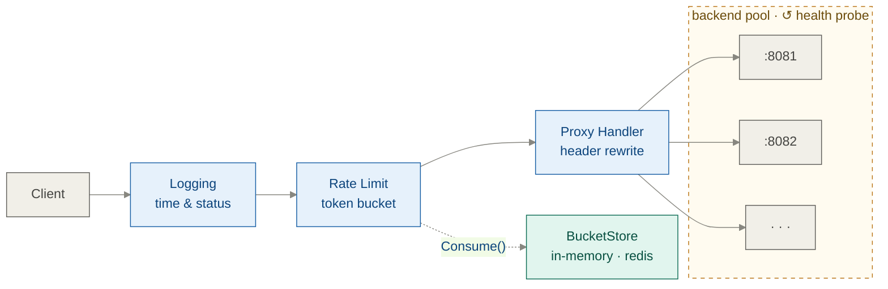

# rate-proxy

A reverse proxy with per-client token bucket rate limiting and active health-checked load balancing.
 
---

## Architecture



A request enters the logging middleware, which starts a timer and records the final status code. It passes to the rate limiter, which checks the client's token bucket by IP and either allows or rejects the request before any backend is touched. Allowed requests reach `ProxyHandler`, which asks the balancer for a healthy backend, retrieves or creates a cached `ReverseProxy` for that address, rewrites the request headers, and streams the response back. Independently, one goroutine per backend runs a continuous health check loop with exponential backoff, marking backends up or down via an atomic bool.

## How to Run
 
**Prerequisites:** Go 1.21+. For Redis-backed rate limiting: Docker.
 
```bash
# Clone and run with in-memory store (default)
git clone https://github.com/Adam-445/rate-proxy
cd rate-proxy
 
# Start three backends in separate terminals
PORT=8081 go run ./cmd/backend &
PORT=8082 go run ./cmd/backend &
PORT=8083 go run ./cmd/backend &
 
# Start the proxy
go run ./cmd/proxy --config config.json
 
# Test it
curl http://localhost:8080/hello
 
# For Redis-backed rate limiting across multiple proxy instances:
docker compose up -d
# then set storage.type = "redis" in config.json
```
 
Run the tests:
```bash
go test ./...
```

